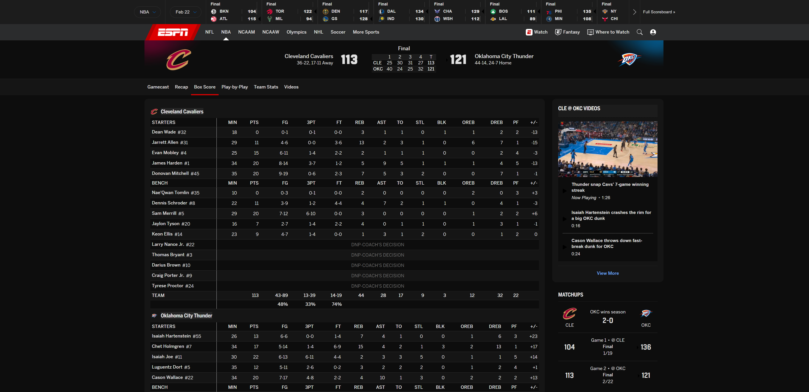

# 🌙 ESPN Dark Mode

A clean, carefully crafted dark theme for ESPN.com — built as a Chrome extension.



## Features

- **True dark backgrounds** — not a cheap `invert()` filter, but proper dark shades with visual hierarchy
- **Readable text** — all text forced to light colors with appropriate contrast levels
- **Preserved media** — team logos, player headshots, images, and videos remain untouched
- **Smart background detection** — JavaScript scanner reads computed styles and replaces light/red backgrounds with the correct dark shade based on element context
- **On/off toggle** — click the extension icon to enable or disable dark mode
- **Subtle borders** — horizontal table lines and structural dividers that don't overwhelm
- **Alternating table rows** — odd/even shading for easy stat reading
- **ESPN red nav bar fixed** — the notoriously stubborn red navigation bar is properly darkened
- **SPA-aware** — handles ESPN's client-side routing and lazy-loaded content
- **Privacy first** — only uses `storage` permission to remember your toggle preference

## Color Palette

| Role | Color | Hex |
|------|-------|-----|
| Page background | ⬛ | `#0d0d0d` |
| Data rows (even) | ⬛ | `#151515` |
| Headers / scoreboard | ⬛ | `#1c1c1c` |
| Team name rows | ⬛ | `#242424` |
| Hover state | ⬛ | `#2e2e2e` |
| Text | ⬜ | `#e0e0e0` |
| Links | 🔵 | `#6eaaff` |
| ESPN accent | 🔴 | `#d63a3a` |

## Install from Chrome Web Store

👉 [ESPN Dark Mode on Chrome Web Store](#) *(link coming soon)*

## Install Manually (Developer Mode)

1. Download or clone this repository
2. Open Chrome and go to `chrome://extensions`
3. Enable **Developer mode** (toggle in top right)
4. Click **Load unpacked**
5. Select the `espn-dark-mode` folder
6. Visit [espn.com](https://www.espn.com) — enjoy!

## How It Works

The extension uses a two-pronged approach:

1. **CSS injection** (at `document_start`) — Immediately sets the root background dark and forces light text on all elements. This prevents the white flash on page load.

2. **JavaScript runtime scanner** (on `DOMContentLoaded`) — Reads `getComputedStyle()` on every element and replaces light or red backgrounds with the appropriate dark shade based on what the element actually is (header, data row, nav, scoreboard, etc.). Runs multiple sweeps during page load and uses a MutationObserver for dynamically loaded content.

## Project Structure

```
espn-dark-mode/
├── manifest.json    # Chrome extension manifest (Manifest V3)
├── content.js       # CSS + JS dark mode engine
├── popup.html       # Toggle UI panel
├── popup.js         # Toggle logic
├── background.js    # Service worker (initializes storage)
├── icons/
│   ├── icon16.png
│   ├── icon48.png
│   └── icon128.png
├── LICENSE
└── PRIVACY.md
```

## Contributing

Pull requests welcome.

## License

MIT License — see [LICENSE](LICENSE)
